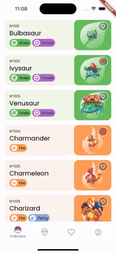
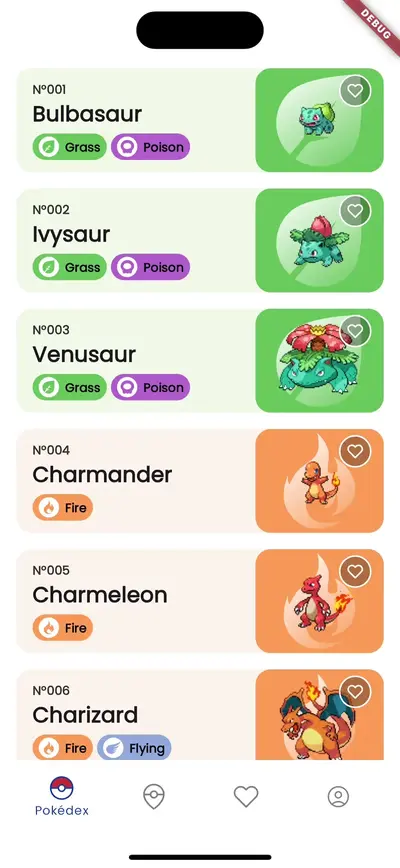
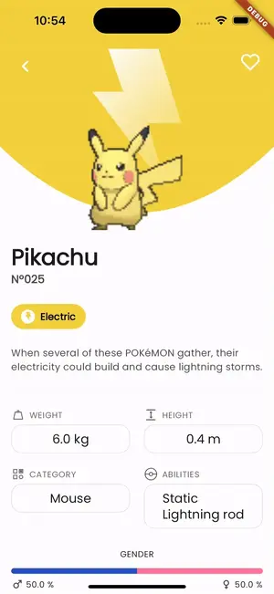
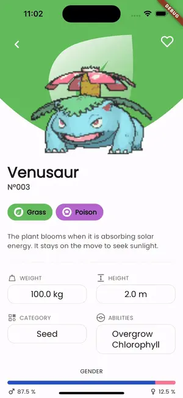
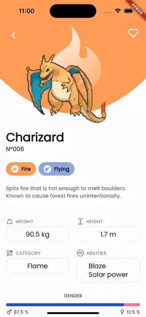

    
</a>

# Flutter Pokedex App

This Pokedex app was built using Flutter, allowing users to explore and search for Pokémon with a beautifully designed interface.

## Reference(Design)

[Figma](https://www.figma.com/community/file/1202971127473077147)

[Creator Profile](https://www.linkedin.com/in/junior-saraiva/)

## Screenshots

    
    
    

    
    
    

    
    
    

## API

[PokeAPI](https://pokeapi.co/) is a RESTful Pokémon API that provides a lot of Pokémon data, including Pokémon, moves, abilities, types, and more.

## State Management Library

    

- Riverpod is a powerful and flexible library for state management and hooks.
- Cache and manage the state of the application using Riverpod.

## Imported Libraries

- [Flutter Riverpod & Hook](https://pub.dev/packages/flutter_riverpod)
- [Flutter Svg](https://pub.dev/packages/flutter_svg)
  - A library for rendering SVG files
- [Auto Route](https://pub.dev/packages/auto_route)
  - A library for generating type-safe routing/navigation
- [Freezed](https://pub.dev/packages/freezed)
  - A code generation library for creating immutable classes
- [Google Fonts](https://pub.dev/packages/google_fonts)
  - A library that makes it easy to use Google Fonts
- [Gap](https://pub.dev/packages/gap)
  - A utility widget that makes it easy to add spacing between widgets
- [Shimmer](https://pub.dev/packages/shimmer)
  - A library that adds a shimmering effect to indicate loading states
- [Http](https://pub.dev/packages/http)
  - A library that makes it easy to make HTTP requests

## Architecture

`Layered architecture`, `MVVM(Model-View-ViewModel)` is used in this project.

    

## Appendix

[Other Mobile Platform (Android Compose/iOS SwiftUi/Flutter)](https://github.com/Origogi/mobile-declarative-pokedex-app?tab=readme-ov-file#plateform)
