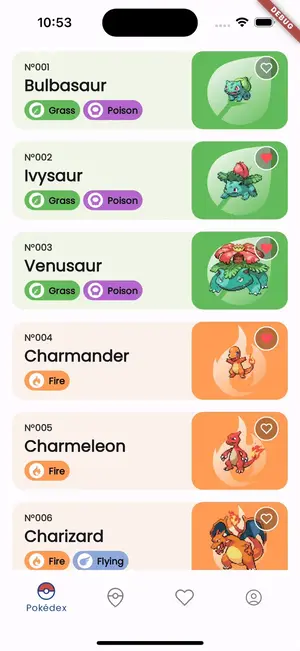
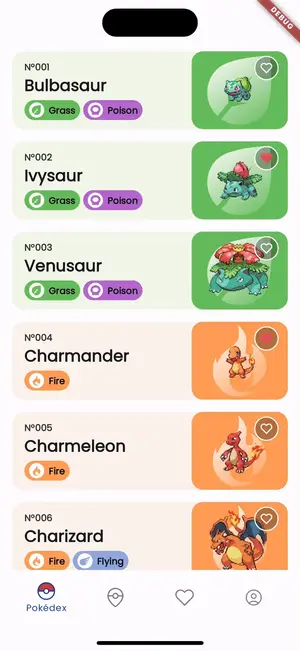
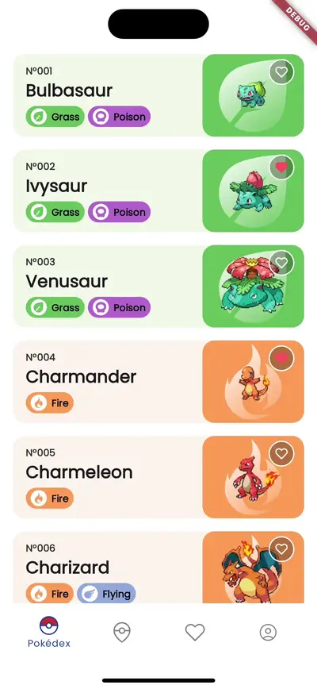
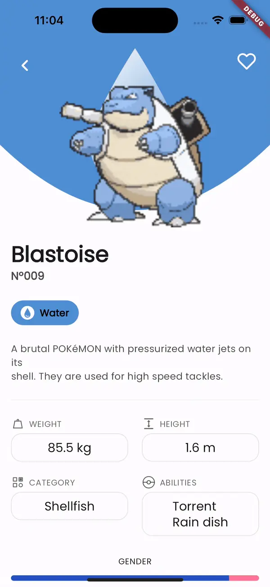

    
</a>

# Flutter Pokedex App

This Pokedex app was built using Flutter, allowing users to explore and search for Pokémon with a beautifully designed interface.

## Reference(Design)

[Figma](https://www.figma.com/community/file/1202971127473077147)

[Creator Profile](https://www.linkedin.com/in/junior-saraiva/)

## Screenshots

    
    
    

    
    
    

    
    
    

## State Management Library

Riverpod

## Imported Libraries

- Flutter Riverpod & Hook
- Flutter Svg
- Auto Route
- Freezed
- Google Fonts
- Gap
- Shimmer
- Http
- Shared Preferences

## Architecture

`Layered architecture`, `MVVM(Model-View-ViewModel)` is used in this project.

    

## Appendix

[Other Mobile Platform](https://github.com/Origogi/mobile-declarative-pokedex-app?tab=readme-ov-file#plateform)
